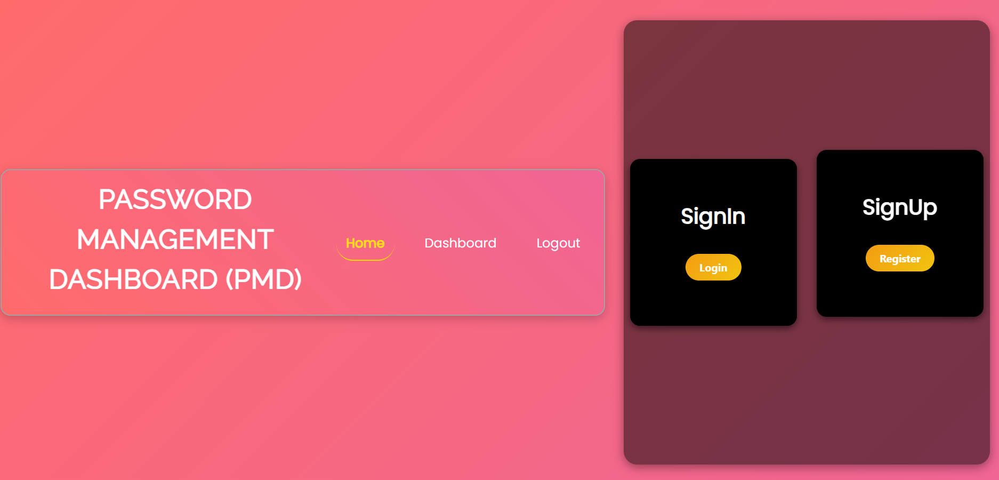
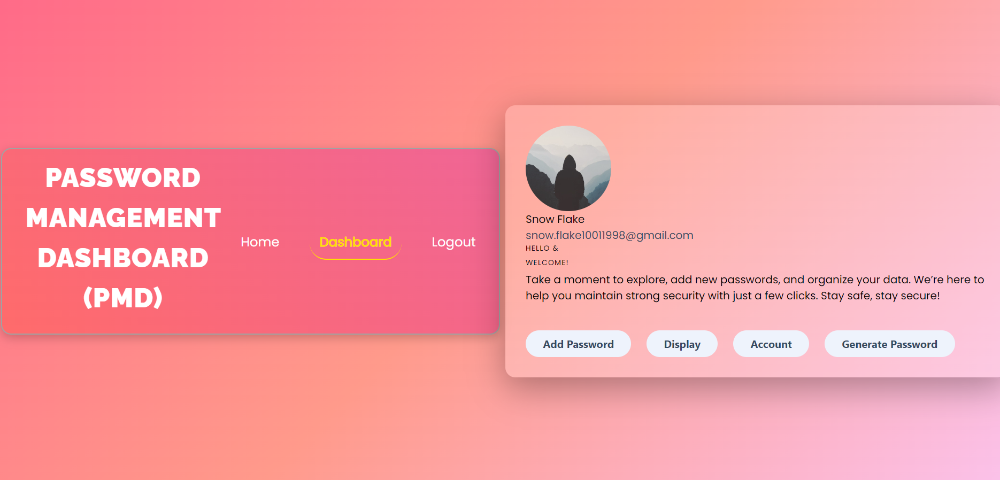
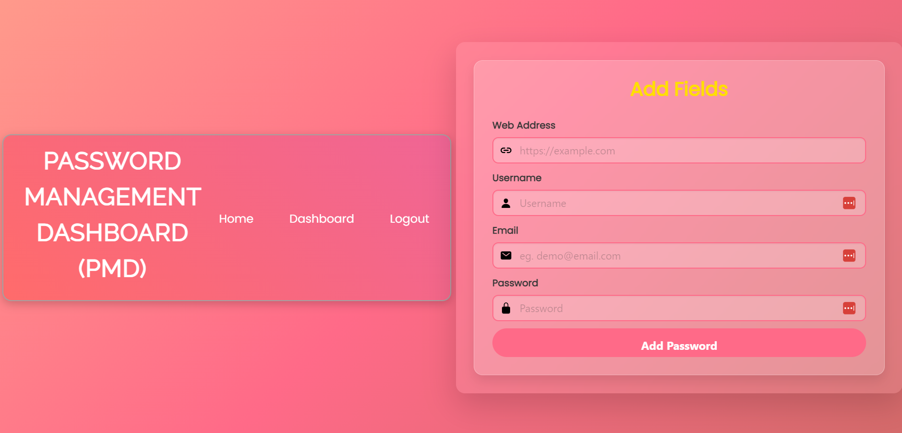
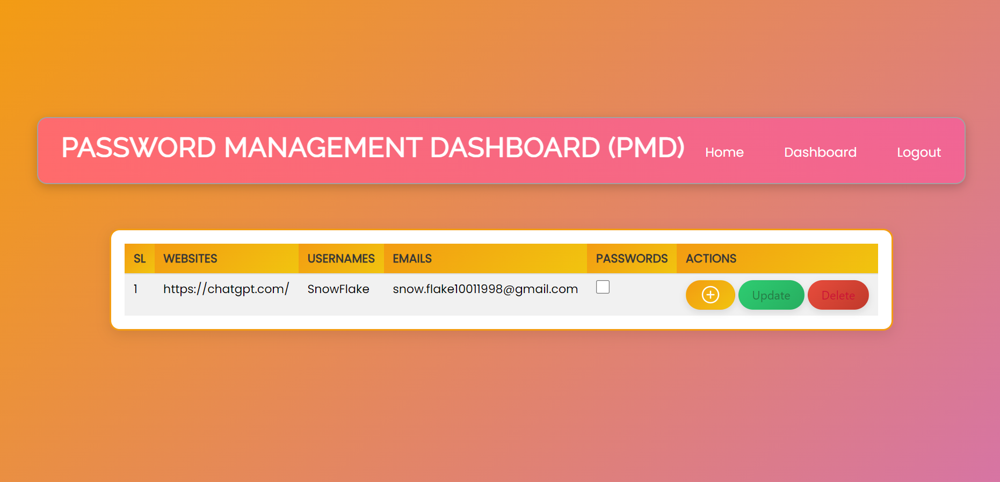
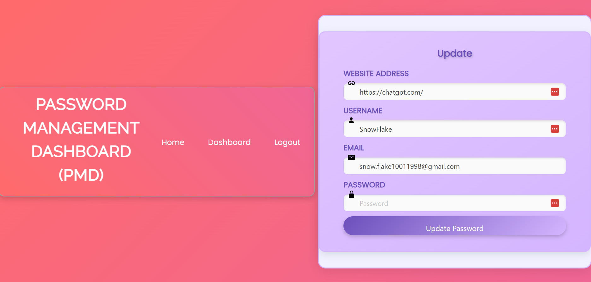
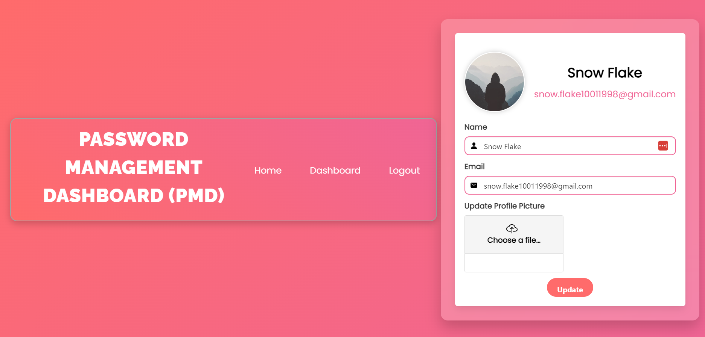
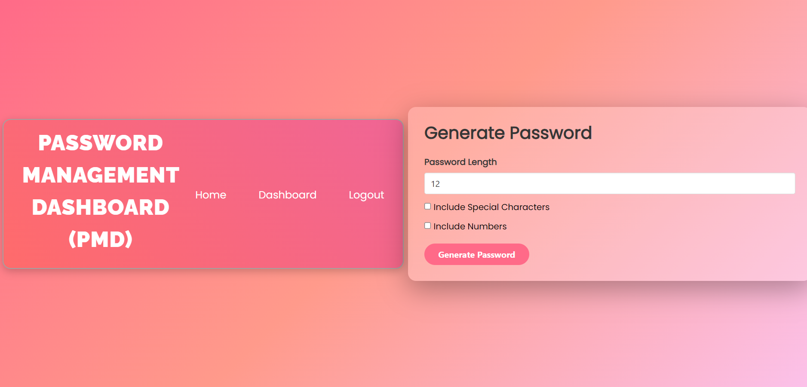

# Password Manager Dashboard ! 

<!-- # install the requirements
$ python3 -m pip install -r requirements.txt

# First execute run.py // This will start the local host
$ python run.py

Go to local host @ (localhost:8000/home) -->

